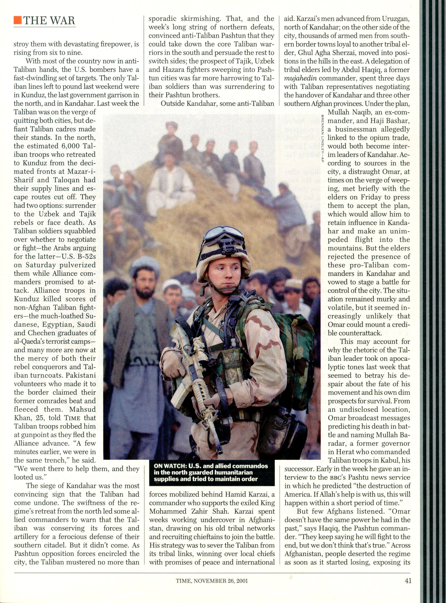
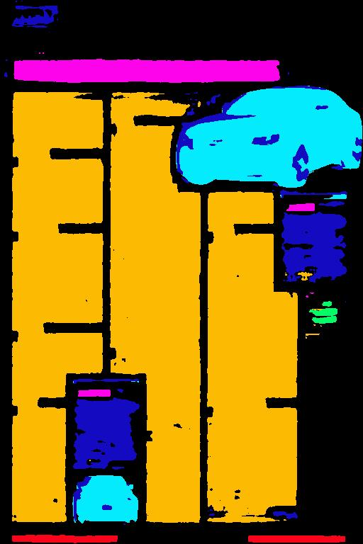

# Unet from "Hundred Layers Tiramisu" paper for document layout segmentation

Vanilla UNet replaced with Dense Blocks

**Label-info**

- body text - yellow
- heading - pink
- caption - green
- header&footer - red
- graphic - light blue
- table - dark_blue

**Logs**

# Results

- IOU - ??
- Accuracy - ??
- Memory Requirements and Inference Speeds - ??

**Visual Results** 

Actual Image            |  Segmented Image
:-------------------------:|:-------------------------:
 | 
 | 
 | 
 | 
 | 

*Last row with the table class!*

