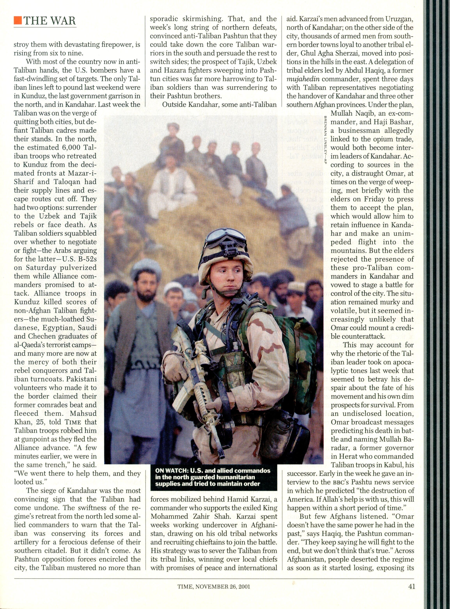
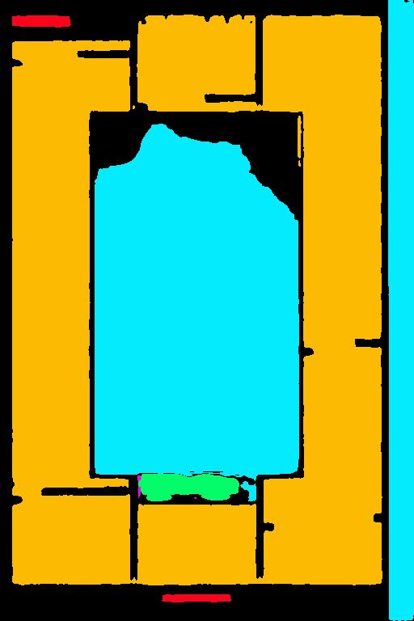
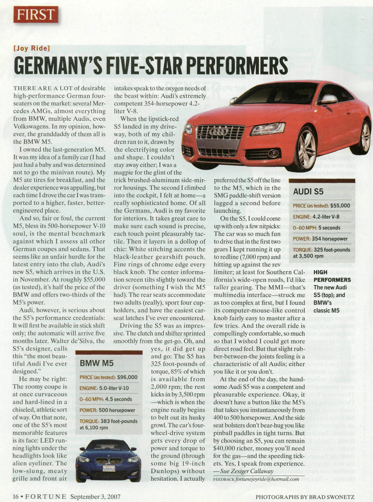
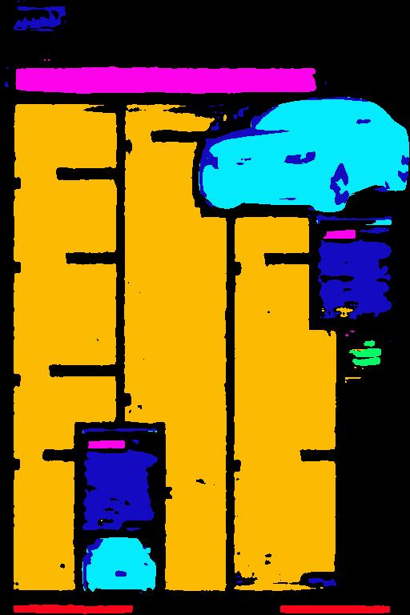

# NLP + OCR project

This project aims to combine the caliber of OCR and NLP for better recognition of printed characters. OCR stands for optical character recognition. It feeds on an image and outputs a set of strings corresponding to the text on the image. OCR, when applied to old / damaged piece of text (where visibility of few words is improper), often fails because it has no understanding of the context. NLP (meaning natural language processing) can be applied over the output to recover the actual text. If successful, this project can be used to digitalize old / damaged books and virtually any damaged printed text.

------
# Implementations and Ideas

[Dense UNet for Segmentation](./Dense-UNET/)

<b>Results</b>

 

Actual Image            |  Segmented Image
:-------------------------:|:-------------------------:
 | 
 | 

